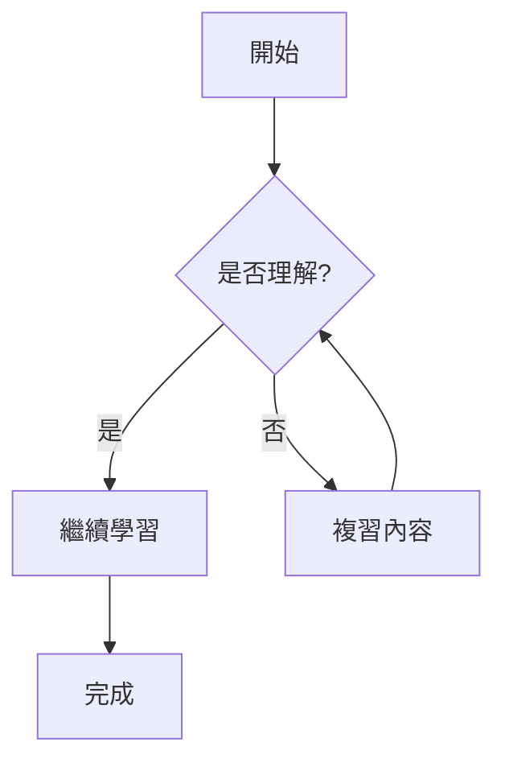

# 📝 FHSH AiSP Slidev 主題使用完整指南

✨ 歡迎使用 **Slidev Theme FHSH AiSP**！這份完整指南將帶您從零開始，學會如何使用這個專為復興高中 AI 資安學程設計的專業 Slidev 主題，打造出色的技術簡報。

## 🎯 快速導覽

本指南包含以下主要內容：

- 🚀 [快速開始](#快速開始)
- 🎨 [主題設定](#主題設定)  
- 🖼️ [版面配置詳解](#版面配置詳解)
- 💻 [程式碼高亮](#程式碼高亮)
- 🎪 [樣式自訂](#樣式自訂)
- ⚡ [進階功能](#進階功能)
- 💼 [實務案例](#實務案例)
- ❓ [常見問題](#常見問題)

## 🚀 快速開始

### 第一步：建立您的簡報檔案

建立一個新的 Markdown 檔案，例如 `my-presentation.md`：

```markdown
---
theme: '@cxphoenix/slidev-theme-fhsh-aisp'
title: '我的第一份 FHSH AiSP 簡報'
info: |
  ## 復興高中 AI 資安學程
  使用 Slidev Theme FHSH AiSP 製作
---

# 歡迎來到 FHSH AiSP！
## 開始您的簡報之旅

---

# 第一張投影片

這是您的第一張內容投影片。

- 輕鬆建立專業簡報
- 支援 Markdown 語法
- 豐富的視覺效果
```

**注意**：第一張投影片會自動使用 cover layout，只會顯示 H1 和 H2 標題。

### 第二步：啟動預覽

```bash
slidev my-presentation.md
```

瀏覽器會自動開啟，您可以即時預覽您的簡報效果！

## 🎨 主題設定

### 🔧 基本設定選項

您可以在簡報檔案的 frontmatter 中自訂各種設定，讓簡報更符合您的需求：

```yaml
---
theme: '@cxphoenix/slidev-theme-fhsh-aisp'

# 📝 簡報基本資訊
title: '人工智慧與資訊安全'
info: |
  ## 復興高中 AI 資安學程
  探討 AI 在資安領域的應用與挑戰
  
# 🎨 視覺設定
fonts:
  sans: 'Noto Sans TC'        # 預設字體
  mono: 'Fira Code'           # 等寬字體
aspectRatio: '16/9'           # 投影片比例
colorSchema: 'light'          # 色彩模式

# 📄 版面設定
layout: 'default'             # 預設版面
titleTemplate: '%s - FHSH AiSP'  # 頁面標題範本

# 🎯 功能設定
lineNumbers: true             # 程式碼行號
highlighter: 'shiki'          # 語法高亮器
drawings:
  enabled: true               # 啟用繪圖功能
  persist: false              # 不儲存繪圖

# 📱 簡報設定
presenter: true               # 簡報者模式
download: true                # 允許下載
exportFilename: 'fhsh-aisp-presentation'  # 匯出檔名

# 📑 頁碼設定
skipPageNumberLayouts:        # 不顯示頁碼的版面
  - cover
  - section
---
```

### 🎭 主題預設值

本主題已為您預設了最佳的設定值：

| 設定項目 | 預設值 | 說明 |
|---------|-------|------|
| 字體 | Noto Sans TC | 優化繁體中文顯示 |
| 等寬字體 | Fira Code | 程式碼顯示字體 |
| 比例 | 16:9 | 標準簡報比例 |
| 色彩模式 | light | 亮色主題 |
| 版面 | default | 標準內容版面 |

## 🖼️ 版面配置詳解

本主題提供四種精心設計的版面配置，另外新增了實驗性的 quiz 測驗版面，每種都有其特定的用途和最佳實踐。

### 🏠 封面版面 (`cover`)

**用途**：簡報的開場頁面，展示主要標題

**特色**：
- 繼承自 section 版面，具有相同的顯示限制
- 包含 FHSH AiSP 專屬標誌
- 自動置中 h1 和 h2 標題
- 不顯示頁碼
- **重要限制**：只會顯示第一個 h1 和第一個 h2，其他所有內容都會被隱藏

```markdown
---
layout: cover
---

# 人工智慧與資訊安全
## 深度學習在網路安全的應用
```

**重要注意事項**：
- ⚠️ **只能使用一個 h1 和一個 h2**
- ⚠️ **不能添加其他文字、段落或清單**，因為會被 CSS 隱藏
- ✅ 使用 H1 作為主標題
- ✅ 使用 H2 作為副標題（可選）
- ❌ 避免添加講者、日期等額外資訊，因為不會顯示

### 📝 預設版面 (`default`)

**用途**：標準內容展示，適合大部分簡報內容

**特色**：
- 支援完整的 Markdown 語法
- 自動頁碼顯示
- 最佳化的文字間距和大小
- 特殊的清單標記符號
- 右下角有小型 FHSH AiSP 標誌
- **第一個 h1 特殊處理**：會顯示為頁面標題（置頂居中），其他 h1 會被隱藏

```markdown
---
layout: default
---

# 機器學習基礎概念

## 監督式學習

監督式學習是機器學習的一個重要分支，其特點包括：

- **有標記的訓練資料**
  - 輸入特徵（Features）
  - 對應的標籤（Labels）
- **預測新資料**
  - 分類問題
  - 迴歸問題

### 常見演算法

1. 線性迴歸
2. 決策樹
3. 支援向量機（SVM）
```

**重要注意事項**：
- ✅ **第一個 H1 會作為頁面標題**，顯示在頂部居中位置
- ⚠️ **其他 H1 會被隱藏**，建議使用 H2、H3 等作為內容標題
- ✅ 支援完整的 H2、H3、段落、清單等元素
- 📍 內容區域位於投影片的中央區域

**版面元素說明**：
- `❖` 第一層清單標記
- `➢` 第二層清單標記  
- `◼︎` 第三層清單標記

### 🏷️ 章節版面 (`section`)

**用途**：章節分隔頁，用於標示新章節的開始

**特色**：
- 包含右側裝飾圖片
- 不顯示頁碼
- 特殊的文字定位（左側偏移）
- **重要限制**：只會顯示第一個 h1 和第一個 h2，其他所有內容都會被隱藏

```markdown
---
layout: section
---

# 第二章：深度學習應用
## 卷積神經網路在影像辨識的突破
```

**重要注意事項**：
- ⚠️ **只能使用一個 h1 和一個 h2**
- ⚠️ **不能添加其他文字、段落或清單**，因為會被 CSS 隱藏
- ✅ H1 會顯示在較上方位置，有左側 padding
- ✅ H2 會顯示在 H1 下方，有更大的左側 padding 和較小字體
- 📍 文字會被定位在左側，右側有裝飾圖片

### 🔧 章節圖片自訂

您可以透過 `sectionImg` 與 `sectionImgStyleClass` 參數自訂章節頁面的圖片與樣式：

**單頁設定**：
```yaml
---
layout: section
sectionImg: '/assets/custom-section.png'
sectionImgStyleClass: 'right-10 w-1/2 opacity-80'
---

# 自訂章節圖片
## 展示自訂圖片功能
```

**全域設定 (Global Config)**：
您也可以在第一頁的 frontmatter 設定全域預設值：

```yaml
---
sectionImg: 'https://source.unsplash.com/random/800x600'
sectionImgStyleClass: 'right-0 w-[60%]'
---
```

**參數說明**：

| 參數 | 說明 | 預設值 |
|------|------|--------|
| `sectionImg` | 自訂章節圖片 URL | 主題預設圖片 (`section-img.png`) |
| `sectionImgStyleClass` | 自訂圖片 Tailwind CSS 樣式類別 | `right-[5.5%] w-[48%]` |

### 🖼️ 圖片版面 (`image`)

**用途**：以圖片為主的內容展示

**特色**：
- 繼承自 default 版面，具有相同的基本佈局
- **重要限制**：只會顯示第一個段落中的第一個圖片
- 圖片會以 object-cover 方式填滿容器
- 所有其他內容（標題、文字等）都會被隱藏
- 圖片會置中顯示

```markdown
---
layout: image
---


```

**重要注意事項**：
- ⚠️ **只會顯示第一個段落的第一個圖片**
- ⚠️ **不支援 frontmatter 的 `image` 欄位**，必須使用 Markdown 圖片語法
- ⚠️ **標題、文字、其他圖片都會被隱藏**
- ✅ 圖片路徑可以是相對路徑或絕對路徑
- ✅ 支援各種圖片格式（PNG、JPG、SVG 等）

**正確的使用方式**：

```markdown
---
layout: image
---


```

**錯誤的使用方式**：

```markdown
---
layout: image
image: '/path/to/image.jpg'  # ❌ 這個設定不會生效
---

# 標題不會顯示   # ❌ 標題會被隱藏
  # ✅ 這個會顯示
  # ❌ 第二個圖片會被隱藏

其他文字不會顯示  # ❌ 文字會被隱藏
```

### 🎮 測驗版面 (`quiz`)

**用途**：互動式測驗功能，適合課堂教學與學習評量

**特色**：
- 繼承自 default 版面，具有完整的標題顯示功能
- 內建 MultiChoice 多選題元件
- 支援離線模式和線上 WebSocket 模式
- 自動答案驗證與視覺化回饋
- 可設定正確答案進行即時評分

```markdown
---
layout: quiz
ans: 2
# isOffline: true  # 預設值，可省略
---

# 機器學習基礎測驗

下列何者是監督式學習的特徵？

- 不需要標記資料
- 需要輸入特徵和對應標籤
- 只能用於聚類分析
- 無法進行預測
```

**版面參數設定**：

| 參數 | 類型 | 預設值 | 說明 |
|------|------|--------|------|
| `ans` | Number | 0 | 正確答案編號（1-4，0表示不設定答案） |
| `isOffline` | Boolean | true | 是否使用離線模式（目前僅支援 true） |
| `wsUrl` | String | "ws://localhost:8000" | WebSocket 服務器地址（🚧 未來功能） |

**重要注意事項**：
- ✅ **支援完整的 H1 標題顯示**，會作為測驗主題
- ✅ **自動解析選項**：最後一個清單會被識別為選項
- ✅ **視覺化回饋**：正確答案顯示綠色，錯誤答案顯示紅色
- ⚠️ **選項數量限制**：目前支援最多 4 個選項（A、B、C、D）
- ⚠️ **答案編號**：使用 1-4 表示選項 A-D，0 表示不顯示正確答案
- 🚧 **目前僅支援離線模式**：線上 WebSocket 模式正在開發中

**答案回饋顏色系統**：
- 🟢 **綠色邊框**：選擇正確且為標準答案
- 🔴 **紅色邊框**：選擇錯誤
- 🟡 **黃色邊框**：已選擇但未設定標準答案（ans=0）

**測驗內容格式**：

```markdown
---
layout: quiz
ans: 3
---

# 測驗標題

問題描述內容可以有多行
支援 Markdown 格式

- 選項 A
- 選項 B  
- 選項 C
- 選項 D
```

**支援模式說明**：

| 模式 | 設定 | 狀態 | 功能說明 |
|------|------|------|----------|
| 🔌 **離線模式** | `isOffline: true` | ✅ 可用 | 本地端測驗，適合個人學習或演示 |
| 🌐 **線上模式** | `isOffline: false` | 🚧 開發中 | 將支援 WebSocket 連接，適合課堂互動 |

## 💻 程式碼高亮

本主題使用 [Shiki](https://shiki.matsu.io/) 進行專業的語法高亮，內建 `vitesse-light` 和 `vitesse-dark` 兩種精美主題。

### 🎨 支援的程式語言

主題支援所有主流程式語言的語法高亮：

````markdown
```python
# Python 範例
def fibonacci(n):
    if n <= 1:
        return n
    return fibonacci(n-1) + fibonacci(n-2)

print(fibonacci(10))
```

```javascript
// JavaScript 範例
const fetchData = async (url) => {
  try {
    const response = await fetch(url);
    return await response.json();
  } catch (error) {
    console.error('錯誤:', error);
  }
};
```

```cpp
// C++ 範例
#include <iostream>
#include <vector>

int main() {
    std::vector<int> numbers = {1, 2, 3, 4, 5};
    for (const auto& num : numbers) {
        std::cout << num << " ";
    }
    return 0;
}
```
````

### ⚙️ 程式碼區塊功能

支援多種實用功能：

````markdown
```python {1,3-5} {maxHeight:'300px'}
# 高亮特定行
def example_function():
    print("第一行會被高亮")
    print("這行不會")
    print("第三到五行會被高亮")
    print("第五行")
    print("這行不會")
```

```bash
# 帶有行號
npm install @cxphoenix/slidev-theme-fhsh-aisp
pnpm run dev
```
````

## 🎪 樣式自訂

### 🎨 CSS 變數自訂

您可以透過覆寫 CSS 變數來自訂主題外觀：

```css
/* 在您的自訂 CSS 中 */
:root {
  /* 主要色彩 */
  --slidev-theme-primary: #3b82f6;
  --border-blue: #6bbae7;
  
  /* 字體設定 */
  --slidev-theme-font-family-default: "Noto Sans TC", sans-serif;
  
  /* 背景設定 */
  --slidev-slide-container-background: #ffffff;
}
```

### 🎭 客製化樣式

您可以在 frontmatter 中加入自訂 CSS：

```yaml
---
theme: '@cxphoenix/slidev-theme-fhsh-aisp'
css: |
  .custom-title {
    color: #ff6b6b;
    text-shadow: 2px 2px 4px rgba(0,0,0,0.3);
  }
  
  .highlight-box {
    background: linear-gradient(45deg, #ff9a9e, #fecfef);
    padding: 20px;
    border-radius: 10px;
    margin: 20px 0;
  }
---
```

### 🎨 版面客製化

您也可以建立自己的版面覆寫：

```vue
<!-- layouts/custom.vue -->
<template>
  <div class="custom-layout">
    <header class="custom-header">
      <h1>自訂標題</h1>
    </header>
    <main class="custom-content">
      <slot />
    </main>
    <footer class="custom-footer">
      <p>自訂頁尾</p>
    </footer>
  </div>
</template>

<style scoped>
.custom-layout {
  background: linear-gradient(135deg, #667eea 0%, #764ba2 100%);
  color: white;
  height: 100%;
  display: grid;
  grid-template-rows: auto 1fr auto;
}
</style>
```

## 🎮 MultiChoice 元件詳解

### 📦 元件概述

MultiChoice 是本主題的核心互動元件，專為教育場景設計的多選題測驗工具。

**主要功能**：
- 🎯 **自動題目解析**：從 Markdown 內容自動提取問題和選項
- 🎨 **視覺化回饋**：即時顯示答案正確性的色彩回饋
- 🔒 **防重複作答**：選擇後自動鎖定，避免重複點擊
- 🔌 **離線模式支援**：目前僅支援本地端測驗功能

### ⚙️ 元件屬性

| 屬性名稱 | 類型 | 預設值 | 驗證規則 | 說明 |
|----------|------|--------|----------|------|
| `isOffline` | Boolean | `true` | 目前僅支援 true | 控制是否為離線模式 |
| `wsUrl` | String | `"ws://localhost:8000"` | 未來功能 | WebSocket 連線地址（🚧 預留參數） |
| `ans` | Number | `0` | 0-4 的整數 | 正確答案編號（0=不設定答案） |

### 🎨 視覺化狀態

MultiChoice 元件提供三種視覺化狀態：

```css
/* 正確答案 */
.correct-answer {
  border: 4px solid #166534; /* 綠色邊框 */
  background: #4ade80;       /* 綠色背景 */
}

/* 錯誤答案 */
.wrong-answer {
  border: 4px solid #991b1b; /* 紅色邊框 */
  background: #fb7185;       /* 紅色背景 */
}

/* 未設定標準答案 */
.no-standard-answer {
  border: 4px solid #a16207; /* 黃色邊框 */
  background: #facc15;       /* 黃色背景 */
}
```

### 🔧 使用範例

**基本測驗範例**：

```markdown
---
layout: quiz
ans: 2
# isOffline: true  # 預設值，可省略
---

# Python 基礎語法測驗

下列哪個是 Python 中正確的變數命名方式？

- 2variable
- my_variable
- my-variable
- variable@name
```

**複雜問題範例**：

```markdown
---
layout: quiz
ans: 4
---

# 機器學習概念測驗

在深度學習中，下列關於卷積神經網路（CNN）的描述，何者正確？

CNN 主要用於處理具有網格結構的資料，如圖像。
它通過卷積層、池化層和全連接層組成。

- 僅適用於圖像分類任務
- 不能處理序列資料
- 只包含卷積層和池化層
- 善於捕捉局部特徵並具有平移不變性
```

### 🚧 WebSocket 整合（未來功能）

線上模式目前正在開發中，預計將支援以下功能：

**計劃中的使用方式**：

```yaml
---
layout: quiz
isOffline: false  # 🚧 尚未實作
wsUrl: "wss://your-server.com/quiz"
ans: 3
---
```

**計劃中的 WebSocket 訊息格式**：

```javascript
// 客戶端發送答案
{
  type: "answer",
  questionId: "slide-5",
  answer: 2,
  timestamp: "2024-01-15T10:30:00Z"
}

// 服務端回應
{
  type: "result", 
  correct: true,
  correctAnswer: 2,
  explanation: "這是正確答案的解釋"
}
```

> 📝 **注意**：目前設定 `isOffline: false` 會導致頁面空白，請使用預設的離線模式。

## ⚡ 進階功能

### 🎮 簡報互動功能

Slidev 內建多種互動功能，配合本主題使用效果更佳：

```markdown
---
layout: default
---

# 互動式內容

<div v-click>

## 點擊動畫
這段文字會在點擊後出現

</div>

<div v-click="2">

逐步顯示內容，增加簡報互動性

</div>

<!-- 程式碼動畫 -->
```ts {1|2-3|4}
function greet(name: string) {
  const message = `Hello, ${name}!`
  console.log(message)
  return message
}
```
```

### 🎨 動畫與過場效果

```yaml
---
transition: slide-left
---

# 投影片過場動畫

支援多種過場效果：
- slide-left / slide-right
- slide-up / slide-down  
- fade / fade-out
- zoom
```

### 📊 內嵌圖表與圖表

支援 Mermaid 圖表：

````markdown

````

### 🔗 超連結與導航

```markdown
<!-- 跳轉到特定投影片 -->
[回到封面](1)
[前往第五張投影片](5)

<!-- 外部連結 -->
[Slidev 官網](https://sli.dev)
[FHSH AiSP](https://www.fhsh.tp.edu.tw/)
```

## 💼 實務案例

### 📚 完整課程簡報範例

以下是一個完整的 AI 資安課程簡報範例，包含測驗功能：

```markdown
---
theme: '@cxphoenix/slidev-theme-fhsh-aisp'
title: 'AI 在網路安全的應用'
info: |
  ## 復興高中 AI 資安學程
  探討人工智慧技術在資訊安全領域的創新應用
fonts:
  sans: 'Noto Sans TC'
  mono: 'Fira Code'
highlighter: shiki
lineNumbers: true
---

# AI 在網路安全的應用
## 從理論到實務

---
layout: section
---

# 第一章：AI 與資安概論

## 人工智慧如何改變資安防護

---

# 傳統資安 vs AI 資安

## 傳統方法的限制

- **規則導向**：依賴預定義的規則和特徵碼
- **被動防護**：只能偵測已知威脅
- **人工分析**：需要大量專家手動分析

## AI 方法的優勢

- **模式學習**：自動學習攻擊模式
- **主動防護**：可偵測未知威脅（Zero-day）
- **自動化**：大幅減少人工干預需求

---
layout: quiz
ans: 2
# isOffline: true  # 預設值，可省略
---

# 概念測驗：AI 資安優勢

下列何者是 AI 在資安防護上的主要優勢？

- 完全取代人工分析師
- 能夠偵測未知威脅模式
- 不需要任何訓練資料
- 保證 100% 防護成功率

---
layout: image
---


---

# 實作範例：異常偵測

```python
import numpy as np
from sklearn.ensemble import IsolationForest

# 載入網路流量資料
def load_network_data():
    # 模擬網路流量特徵
    normal_traffic = np.random.normal(0, 1, (1000, 5))
    anomaly_traffic = np.random.normal(3, 1, (50, 5))
    return np.vstack([normal_traffic, anomaly_traffic])

# 建立異常偵測模型
def create_anomaly_detector():
    model = IsolationForest(contamination=0.1)
    return model

# 主程式
data = load_network_data()
detector = create_anomaly_detector()
detector.fit(data)

# 預測異常
predictions = detector.predict(data)
print(f"偵測到 {np.sum(predictions == -1)} 個異常連線")
```

---
layout: quiz
ans: 3
# isOffline: true  # 預設值，可省略
---

# 程式測驗：Isolation Forest

在上述程式碼中，`contamination=0.1` 參數的意義是什麼？

- 表示訓練資料中有 10% 是正常流量
- 設定模型的學習率為 0.1
- 預期異常資料約佔總資料的 10%
- 設定模型精確度闾值為 90%

---
layout: section
---

# 第二章：深度學習在資安的應用

## CNN、RNN 與 Transformer 模型

---

# 課程總結

## 今日學到的重點

- ✅ AI 在資安領域的重要性
- ✅ 機器學習異常偵測技術
- ✅ 深度學習模型應用
- ✅ 實務程式碼實作

## 下次課程預告

- 🔮 生成對抗網路（GAN）在資安的應用
- 🛡️ 強化學習自動化防護系統
- 🚀 最新 AI 資安研究趨勢

---
layout: quiz
ans: 4
# isOffline: true  # 預設值，可省略
---

# 課程回顧測驗

本次課程中，我們討論了哪些 AI 技術在資安的應用？

- 僅討論監督式學習
- 只介紹了 Isolation Forest
- 專注於傳統機器學習方法
- 涵蓋異常偵測和深度學習模型

---

# 謝謝聆聽！

## Q&A 時間

有任何問題歡迎提出討論 🤔
```

### 🏢 企業簡報範例

適合技術會議或產品展示：

```markdown
---
theme: '@cxphoenix/slidev-theme-fhsh-aisp'
title: '企業 AI 資安解決方案'
layout: cover
---

# 企業 AI 資安解決方案
## 次世代威脅防護平台

---
layout: section
---

# 產品概述

## 全方位 AI 驅動資安防護

---

# 核心功能特色

<div class="grid grid-cols-2 gap-8">

<div>

## 🛡️ 即時威脅偵測
- 99.9% 準確率
- < 1ms 反應時間
- 支援 Zero-day 攻擊偵測

</div>

<div>

## 🤖 自動化回應
- 智慧型威脅分析
- 自動隔離與修復
- 學習型防護策略

</div>

</div>

---
layout: image
---


```

## ❓ 常見問題

### Q: 如何解決字體顯示問題？

A: 確保已正確載入 Noto Sans TC 字體：

```css
/* 在自訂 CSS 中 */
@import url("https://fonts.googleapis.com/css2?family=Noto+Sans+TC:wght@100..900&display=swap");
```

### Q: 可以自訂頁碼樣式嗎？

A: 可以，請在自訂 CSS 中覆寫相關樣式：

```css
.slidev-layout p {
  /* 自訂頁碼樣式 */
  font-size: 1.2rem;
  color: #666;
  background: rgba(255,255,255,0.8);
  padding: 5px 10px;
  border-radius: 5px;
}
```

### Q: 如何匯出高品質 PDF？

A: 使用以下指令匯出：

```bash
slidev export slides.md --format pdf --quality 100
```

### Q: 支援 RTL（右到左）文字嗎？

A: 主題主要針對繁體中文最佳化，如需 RTL 支援請添加自訂 CSS：

```css
.rtl-content {
  direction: rtl;
  text-align: right;
}
```

### Q: 如何在簡報中嵌入影片？

A: 使用 HTML 標籤：

```html
<video controls width="800">
  <source src="./assets/demo-video.mp4" type="video/mp4">
  您的瀏覽器不支援影片播放
</video>
```

### Q: 測驗功能的選項數量有限制嗎？

A: 是的，目前 MultiChoice 元件支援最多 4 個選項（A、B、C、D）。這是為了確保在投影片上有良好的視覺陣列。如需更多選項，建議：

- 將問題拆分成多個測驗投影片
- 使用不同的問題類型（是非題、單選題等）
- 等待未來版本支援更多選項

### Q: 可以自訂測驗的視覺樣式嗎？

A: 可以，請在自訂 CSS 中覆寫相關樣式：

```css
/* 自訂選項按鈕樣式 */
.quiz .grid > div {
  background: linear-gradient(45deg, #f0f9ff, #e0f2fe);
  border-radius: 12px;
  transition: all 0.3s ease;
}

/* 自訂正確答案樣式 */
.quiz .border-green-800 {
  background: linear-gradient(45deg, #10b981, #34d399) !important;
  box-shadow: 0 4px 20px rgba(16, 185, 129, 0.4);
}
```

> 目前僅離線模式可用，視覺樣式自訂功能正常。

### Q: 如何設定 WebSocket 服務器？

A: 🚧 **目前線上模式尚未完成實作**。未來將支援 WebSocket 服務器整合，參考實作範例：

```javascript
// 🚧 計劃中的 WebSocket 服務器實作
const WebSocket = require('ws');
const wss = new WebSocket.Server({ port: 8000 });

wss.on('connection', (ws) => {
  ws.on('message', (message) => {
    const data = JSON.parse(message);
    // 處理測驗答案邏輯
    ws.send(JSON.stringify({
      type: 'result',
      correct: data.answer === correctAnswer
    }));
  });
});
```

> 目前請使用離線模式 (`isOffline: true`) 進行測驗。

### Q: 測驗結果可以匯出或記錄嗎？

A: 目前離線模式下結果僅顯示在頁面上，不支援記錄功能。未來線上模式完成後，將可在 WebSocket 服務器端實作資料庫儲存記錄功能。

> 如需立即使用記錄功能，建議使用其他線上測驗平臺或等待未來版本更新。

## 📞 技術支援

如果您遇到任何問題或需要協助：

- 📖 查看 [Slidev 官方文件](https://sli.dev/)
- 🐛 回報問題到 [GitHub Issues](https://github.com/CXPhoenix/slidev-theme-fhsh-aisp/issues)
- 💬 加入 [Slidev 社群討論](https://github.com/slidevjs/slidev/discussions)

---

🎉 **恭喜！** 您已經完成了 FHSH AiSP Slidev 主題的完整學習。現在可以開始製作您自己的專業簡報了！
